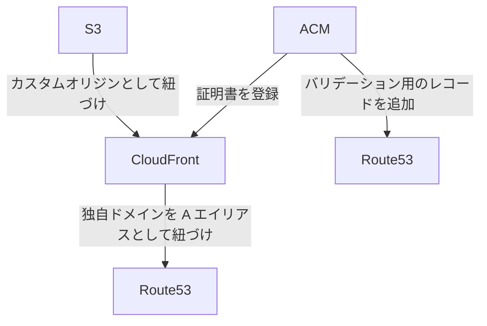

# 独自ドメインの S3 の静的ウェブサイトに SSL 対応する

## 先にやっておくこと

* 使用するドメインの Route53 ホストゾーン登録は済ませておく

## やること

* S3 にバケット作って必要な設定する
* ACM で証明書発行する
* CloudFront の設定する
* Route53 に A レコードを登録する

そのうち WAF の設定やログの設定も追加するかも。しないかも。
もうすでにファイル構成やらだいぶ煩雑になってきてる気がするので、モジュール化なり整理整頓を積極的に進めていきたい。

## おおざっぱな処理の流れ

